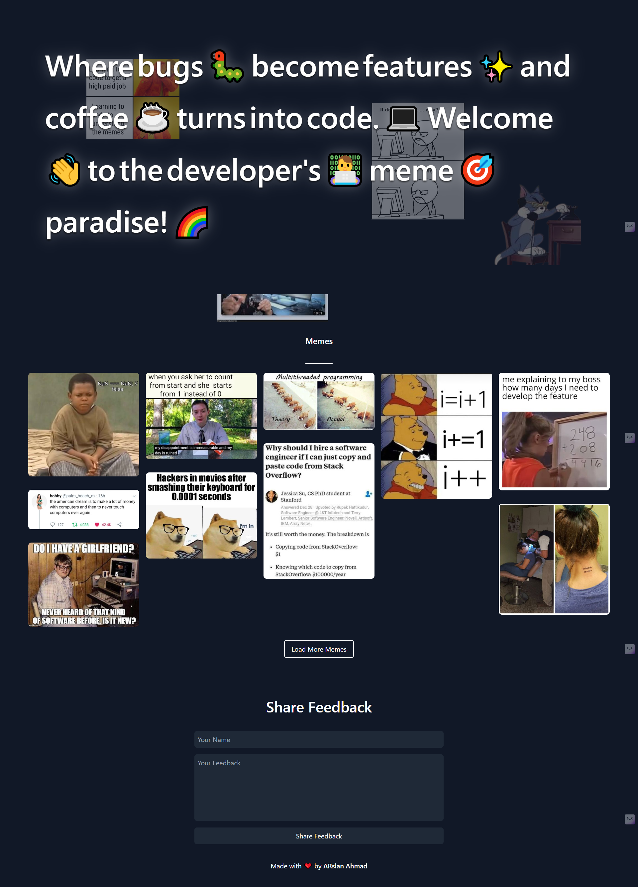

<h1 align="center">🎉 Meme Website</h1>

<div align="center">
  <p align="center">
    A fun and interactive meme website that fetches memes from an API and allows users to share feedback.
    <br />
    <a href="#quick-start">Installation Guide</a>
    ·
    <a href="#how-it-works">How It Works</a>
  </p>
</div>

## 📸 Project Images

<div align="center">

</div>

## ✨ Features

- 🚀 **Fetch Memes** - Instantly fetch memes from a public API.
- 💬 **User Feedback** - Users can share their feedback via a form.
- 📱 **Responsive Design** - Works seamlessly on all devices.
- 🎨 **Interactive UI** - Engaging user interface with animations.
- 📄 **Image Preview** - View enlarged images in a modal.

## 🛠️ Tech Stack


#

## 🚀 Quick Start

```bash
# Clone the repository
git clone https://github.com/Arslan2214/dev-memes.git

# Install dependencies
cd meme_website
npm install

# Start the development server
npm run dev
```

## 📁 Project Structure

```plaintext
meme_website/
├── public/          # Public assets (images, icons)
├── public/             # Source code
│   ├── img/           # Images
│   ├── web/           # Web assets (icons / favicon)
│   └── vite.svg       # Vite icon
├── .gitignore
├── index.html         # HTML file
├── style.css          # Styles
├── animate.js         # Animation logic (GSAP)
├── main.js            # Main JavaScript file
├── package.json       # Project dependencies
└── README.md
```

## 🌟 How It Works

1. 📤 **Fetch Memes**
   - The application fetches memes from a public API.
   - Displays memes in a grid layout.

2. 🔄 **User Interaction**
   - Users can click on memes to view them in a modal.
   - Users can share feedback through a form.

3. 📡 **Feedback Submission**
   - Feedback is sent via EmailJS.
   - Users receive a confirmation alert upon successful submission.

## 📝 License

This project is licensed under the MIT License - see the [LICENSE](LICENSE) file for details.
